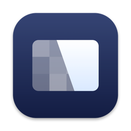

# Crisp

A native macOS menu bar app for managing external displays: HiDPI resolutions, brightness, arrangement, color, and presets. A free, open-source alternative to BetterDisplay: all the core display management features, zero cost.

<p align="center"></p>

<p align="center"></p>

## Features

- **HiDPI on any display**: enable Retina-style scaled resolutions on external monitors, including automatic HiDPI setup for 2K+ displays
- **Brightness everywhere**: hardware DDC control for external monitors with software (gamma) fallback, smooth fades, brightness-key routing to the display under the cursor, and true darkness below the hardware floor
- **Presets**: save named display configurations (resolution, brightness, arrangement) with custom icons and colors, apply with one click, update in place
- **Display arrangement**: drag-to-arrange canvas, main display switching
- **Screen effects**: Dark Mode (with the system's animated transition), Night Shift, True Tone
- **Color**: ICC profile switching, gamma/contrast/gain image adjustment
- **Virtual displays**: create HiDPI virtual screens
- **Extras**: combined brightness slider, auto brightness following the built-in display, notch hiding, launch at login

## Requirements

- macOS 15 (Sequoia) or later; on macOS 26 the panel uses the native Liquid Glass backdrop

## Permissions

- **Accessibility** (System Settings > Privacy & Security > Accessibility): needed only for routing the keyboard brightness keys to the display under the cursor. Without it, everything else still works; the brightness keys just control the built-in display as usual.

## Building

```sh
brew install xcodegen
xcodegen generate   # generates Crisp.xcodeproj from project.yml
open Crisp.xcodeproj
```

`./build.sh` produces a distributable DMG (unsigned; right-click, then Open to bypass Gatekeeper). No Xcode? See [docs/BUILDING.md](docs/BUILDING.md) for a Command Line Tools-only build.

## Origin

Crisp began as a fork of [FreeDisplay](https://github.com/huberdf/FreeDisplay) and has since been substantially rewritten: a custom panel architecture, native controls throughout, a reworked brightness pipeline, and a full redesign. Thanks to FreeDisplay for the foundation and the spirit: free display management for everyone.

## License

[MIT with the Commons Clause](LICENSE): use it and modify it freely, at home or at work, and share your changes. The one thing you can't do is sell Crisp, or charge for a product or service whose value comes substantially from it. Portions derived from FreeDisplay remain available under its MIT terms, reproduced in [LICENSE](LICENSE).
